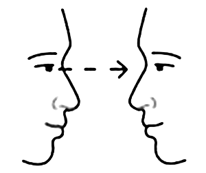
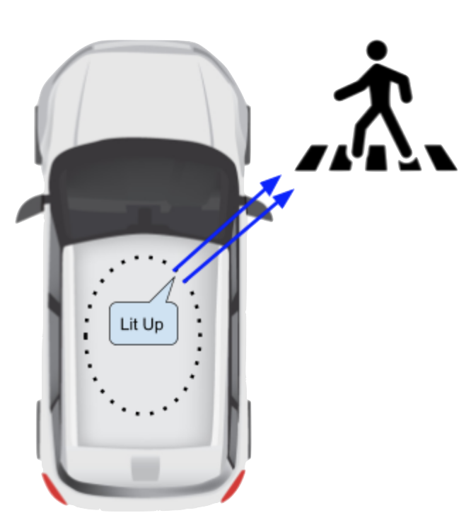

__Autononomous Vehicle to Human Communication__

## Eye Contact 

Remember, if a pedestrian makes eye contact with you, they are ready to cross the street. Yield to the pedestrian. --California Driver Handbook

## No Eyes? 

Self-driving vehicles don't have a human at the wheel so pedestrians need confirmation they are seen.
        Eye contact, head nods and hand waves need replacement.

## Autos Need Eyes 

<a href="https://autoeyes.org" title="Auto Eyes Website">Auto Eyes</a>&trade; is a simple lighting system for one-way communication from the robot to pedestrians, cyclists and other mobile humans.

## Open Source 

Open source and open collaboration will provide a safe and consistent solution to society for the best adoption of autonomous vehicles.

---

  <a class="btn btn-primary btn-lg" tabindex="-1" role="button"  href="https://docs.google.com/document/d/1lKIsqMYYO7nQ937QXdCg2oaPqeo0iI2x5D2HwVKsVNE/edit?usp=sharing">Read the White Paper</a>

---

### Learn More...

  <iframe src="./scenario/all-around/all-around.html" align="center"></iframe>
  

    A string of LEDs on top of the vehicle emits light to communicate with humans outside the vehicle.
  

  <a class="btn btn-primary btn-lg" tabindex="-1" role="button"  href="{{site.baseurl}}/scenario/i-see-you">Next</a>

