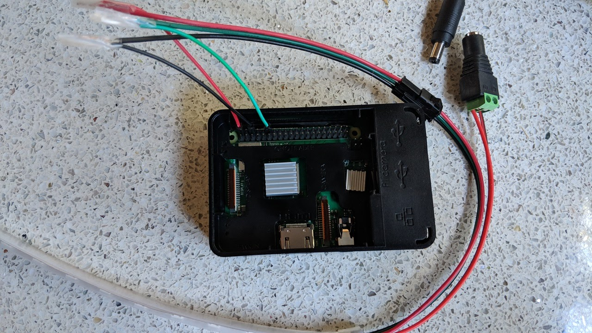
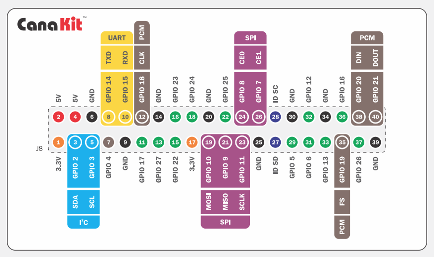

# Auto Eyes Demo
__LED Light Strip Controlled by Python on Raspberry PI__

Auto Eyes is about creating common communication protocols for common road scenarios, however,
technology works better when demonstrated in the real world.

Follow this guide to build your own real world example and see Auto Eyes work with your own eyes.

## Purchase

For approximately $150, you can set up this prototype, although the costs could 
be reduced by a knowledgeable person since this parts list caters to ease of setup. 

* 1 - $37 [5 meter LED Light String](https://smile.amazon.com/gp/product/B00VQ0D2TY/ref=oh_aui_detailpage_o00_s01?ie=UTF8&psc=1)
* 1 - $26 [Power Supply](https://smile.amazon.com/gp/product/B01LXN7MN3/ref=oh_aui_detailpage_o00_s01?ie=UTF8&psc=1)
* 1 - $80 [Raspberry PI Kit](https://smile.amazon.com/gp/product/B07BCC8PK7/ref=oh_aui_detailpage_o00_s00?ie=UTF8&psc=1)
* 1 - $5  [Jumper Wires](https://smile.amazon.com/gp/product/B077N58HFK/ref=oh_aui_detailpage_o00_s00?ie=UTF8&psc=1)

__Optional:__
* 1 - $23 [1 meter LED Light String](https://smile.amazon.com/gp/product/B01DLYSH6U/ref=oh_aui_detailpage_o03_s01?ie=UTF8&psc=1) in addition to or instead of the 5 meter light string

## Assemble

1. Setup the Raspberry PI with the included USB power supply, per the instructions that came with the kit.  
1. Shut the Raspberry PI  down once you confirm it works (either by direct keyboard+monitor or ssh).
1. Connect the LED Strip power wires to the _female DC connector_ using a small screwdriver.
   1. Negative (-) connects to black.
   1. Positive (+) connects to red.  
1. Connect the LED 3pin JST-SM connector to the Raspberry PI GPIO connector with the jumper wires

   1. Use the 3 wire with a female JST-SM connector provided with the LED strip
   1. Choose a red, green and blue jumper wire from the jumper wires  
   1. Cut and strip one end of each of the jumper wires
   1. Connect each jumper wire to the corresponding color of the 3 wire JST-SM connector
       1. Ideally solder each wire, but twist + tape will suffice.
   1. Connect each wire to the GPIO board
       1. Red (Power) -> Pin 2
       2. Black (Ground) -> Pin 6
       3. Green (Data) -> Pin 12

1. Plug the _female DC connector_ to the _male DC connector_ and plug power cord into the wall.
   1. Notice this powers both the LED strip and the Raspberry PI so do not use the USB power supply.
1. Confirm the Raspberry PI is powered up and available. 
1. Continue with the software setup to confirm the light strip is working.

## Software Setup 

The following instructions are excerpts from a [Core Electronics tutorial](https://core-electronics.com.au/tutorials/ws2812-addressable-leds-raspberry-pi-quickstart-guide.html).
Watch the helpful video for more information. 

1. `curl -L http://coreelec.io/33 | bash` 
2. `cd rpi_ws281x/python/examples/`
3. `sudo python strandtest.py`

You should now see 10 lights on your LED Strip cycle through some color changes.

__Auto Eyes__ software setup _To Be Determined_.

## Demo 

__Auto Eyes__ scenario demos _To Be Determined_.

